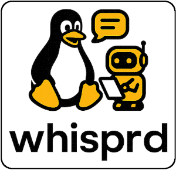

# whisprd



**Real-time Whisper-powered dictation system for Linux**
A powerful, real-time dictation system for Linux that uses OpenAI's Whisper model to convert speech to text and inject keystrokes into any application. Whisprd provides Windows-like dictation functionality with voice commands, auto-punctuation, and low-latency transcription.

FYI this is a personal project by [@AgenticToaster](https://github.com/AgenticToaster) - built to solve a specific problem I had with dictation. This is not a business or community project, just something I found helpful and wanted to share.

## 🎯 What This Is

- **Personal Project**: Built by me, for me, shared with you
- **Problem Solver**: Created to address my own dictation needs
- **Open Source**: Feel free to use, modify, or take ownership
- **Low Maintenance**: I'll update when I can, but it's not my top priority

## 🤝 Contributing

**You're welcome to contribute!** But please understand:

- This is a **personal project**, not a community-driven one
- I may not respond quickly to issues or PRs
- Feel free to fork and take ownership if you want to maintain it actively
- Don't be a jerk - I'm sharing this to help others, not to start a business

If you find this useful and want to keep it updated, consider:
- Forking the repository and maintaining your own version
- Submitting PRs (I'll review when I can)
- Taking over maintenance if you're passionate about it

## 🚀 Features

- **Real-time Speech Recognition**: Uses faster-whisper for GPU-accelerated transcription
- **CUDA GPU Support**: Automatic GPU acceleration with fallback to CPU
- **Voice Commands**: Customizable voice commands for text editing and system control
- **Keystroke Injection**: Low-latency input injection using uinput
- **Auto-punctuation**: Automatic punctuation insertion based on voice cues
- **Global Hotkey**: Toggle dictation with Ctrl+Alt+D (configurable)
- **Command Mode**: Say "computer" to activate command mode for special actions
- **System Integration**: Systemd service for auto-start and daemon mode
- **Rich CLI**: Beautiful terminal interface with real-time status and statistics
- **Configuration**: YAML-based configuration for easy customization
- **Transcript Logging**: Save all transcriptions to file for review
- **Pause Duration Control**: Configurable silence detection for utterance boundaries
- **Alternate Prompts**: Load custom prompts from YAML files for different use cases

## 🎯 Use Cases

- **Document Writing**: Dictate emails, documents, and notes
- **Programming**: Voice code with custom commands
- **Accessibility**: Assist users with typing difficulties
- **Productivity**: Faster text input for power users
- **Multilingual**: Support for multiple languages via Whisper
- **Professional Use**: Business, medical, legal, and technical transcription
- **Creative Writing**: Storytelling, poetry, and dialogue transcription

## 📋 Requirements

### System Requirements
- Linux (tested on Ubuntu 20.04+, Fedora, Arch)
- Python 3.8+
- PulseAudio or PipeWire
- Microphone access
- GPU (optional, for faster transcription)

### Hardware Requirements
- Microphone (USB or built-in)
- Sufficient RAM (4GB+ recommended)
- GPU with CUDA support (optional, for faster-whisper)

## 🛠️ Installation

### Quick Install

1. **Clone the repository**:
   ```bash
   git clone https://github.com/yourusername/whisprd.git
   cd whisprd
   ```

2. **Run the installer**:
   ```bash
   ./install.sh
   ```

3. **Follow the post-install instructions**:
   - Log out and back in for group permissions
   - Load uinput module: `sudo modprobe uinput`
   - Test the system: `/opt/whisprd/whisprd_cli.py`

### Manual Installation

1. **Install dependencies**:
   ```bash
   pip3 install --user -r requirements.txt
   ```

2. **Setup permissions**:
   ```bash
   sudo usermod -a -G input,audio $USER
   sudo modprobe uinput
   echo 'KERNEL=="uinput", MODE="0660", GROUP="input"' | sudo tee /etc/udev/rules.d/99-uinput.rules
   sudo udevadm control --reload-rules
   ```

3. **Copy files**:
   ```bash
   sudo mkdir -p /opt/whisprd
   sudo cp -r whisprd/ /opt/whisprd/
   sudo cp whisprd_cli.py config.yaml requirements.txt /opt/whisprd/
   sudo chown -R $USER:$USER /opt/whisprd
   sudo chmod +x /opt/whisprd/whisprd_cli.py
   ```

## 🎮 Usage

### Basic Usage

1. **Start the system**:
   ```bash
   /opt/whisprd/whisprd_cli.py
   ```

2. **Toggle dictation**: Press `Ctrl+Alt+D`

3. **Start speaking**: The system will transcribe your speech in real-time

4. **Use voice commands**: Say commands like "new line", "backspace", "period"

### Voice Commands

#### Navigation Commands
- `"new line"` - Insert newline
- `"new paragraph"` - Insert double newline
- `"backspace"` - Delete last character
- `"delete word"` - Delete last word
- `"delete line"` - Delete entire line

#### Punctuation Commands
- `"period"` - Insert period
- `"comma"` - Insert comma
- `"question mark"` - Insert question mark
- `"exclamation mark"` - Insert exclamation mark
- `"semicolon"` - Insert semicolon
- `"colon"` - Insert colon
- `"open parenthesis"` - Insert (
- `"close parenthesis"` - Insert )
- `"quote"` - Insert single quote
- `"double quote"` - Insert double quote

#### Text Formatting Commands
- `"capitalize"` - Capitalize selected text
- `"select all"` - Select all text
- `"copy"` - Copy selected text
- `"paste"` - Paste from clipboard
- `"cut"` - Cut selected text
- `"undo"` - Undo last action
- `"redo"` - Redo last action

#### System Commands
- `"stop dictation"` - Stop dictation
- `"start dictation"` - Start dictation
- `"clear text"` - Clear all text

### Command Mode

Say `"computer"` to activate command mode, then speak your command:

```
"computer new line" → Inserts newline
"computer select all" → Selects all text
"computer copy" → Copies selected text
```

### Auto-punctuation

The system automatically detects punctuation words:
- Say `"period"` or `"full stop"` → inserts .
- Say `"comma"` or `"pause"` → inserts ,
- Say `"question mark"` → inserts ?

## ⚙️ Configuration

Edit `~/.config/whisprd/config.yaml` to customize the system:

### Audio Settings
```yaml
audio:
  sample_rate: 16000        # Audio sample rate in Hz
  channels: 1               # Number of audio channels (1 for mono)
  buffer_size: 8000         # Audio buffer size in samples (0.5s at 16kHz)
  device: null              # Audio device (null = default device)
```

### Whisper Settings
```yaml
whisper:
  model_size: "small"       # Model size: tiny, base, small, medium, large
  language: "en"            # Language code (en, es, fr, de, etc.)
  beam_size: 5              # Beam search size for better accuracy
  best_of: 5                # Number of candidates to consider
  temperature: 0.0          # Sampling temperature (0.0 = deterministic)
  condition_on_previous_text: false  # Use previous text as context
  initial_prompt: "Transcribe only what you hear..."  # Initial prompt for Whisper
  
  # GPU/CUDA settings
  use_cuda: true            # Enable CUDA GPU acceleration (auto-fallback to CPU)
  cuda_device: 0            # CUDA device index (0 for first GPU)
  
  # Alternate prompts configuration
  alternate_prompts_file: null  # Path to YAML file with alternate prompts
  use_alternate_prompts: false  # Enable to use prompts from file
```

### Dictation Settings
```yaml
whisprd:
  toggle_hotkey: ["ctrl", "shift", "d"]  # Hotkey to toggle dictation
  command_mode_word: "computer"          # Word to activate command mode
  confidence_threshold: 0.8              # Minimum confidence for transcription
  auto_punctuation: true                 # Enable auto-punctuation
  
  # Auto-punctuation word mappings
  sentence_end_words: ["period", "full stop", "dot"]
  comma_words: ["comma", "pause"]
  question_words: ["question mark", "question"]
  
  # Pause duration settings
  pause_duration: 1.0                    # Seconds of silence to trigger utterance boundary
  min_utterance_duration: 0.7            # Minimum utterance length to transcribe
  overlap_duration: 0.2                  # Seconds to keep as overlap between utterances
```

### Voice Commands
```yaml
commands:
  # Navigation commands
  "new line": "KEY_ENTER"
  "new paragraph": "KEY_ENTER,KEY_ENTER"
  "backspace": "KEY_BACKSPACE"
  "delete word": "KEY_CTRL+KEY_BACKSPACE"
  "delete line": "KEY_CTRL+KEY_A,KEY_DELETE"
  
  # Punctuation commands
  "period": "KEY_DOT"
  "comma": "KEY_COMMA"
  "question mark": "KEY_LEFTSHIFT+KEY_SLASH"
  "exclamation mark": "KEY_LEFTSHIFT+KEY_1"
  
  # Text formatting commands
  "capitalize": "KEY_CTRL+KEY_A,KEY_CTRL+KEY_U"
  "select all": "KEY_CTRL+KEY_A"
  "copy": "KEY_CTRL+KEY_C"
  "paste": "KEY_CTRL+KEY_V"
  "cut": "KEY_CTRL+KEY_X"
  "undo": "KEY_CTRL+KEY_Z"
  "redo": "KEY_CTRL+KEY_Y"
  
  # System commands
  "stop dictation": "STOP_DICTATION"
  "start dictation": "START_DICTATION"
  "clear text": "KEY_CTRL+KEY_A,KEY_DELETE"
```

### Output Settings
```yaml
output:
  save_to_file: true                    # Save transcriptions to file
  transcript_file: "~/whisprd_transcript.txt"  # Transcript file path
  console_output: true                  # Show transcriptions in console
  inject_keystrokes: true               # Inject keystrokes into applications
```

### Performance Settings
```yaml
performance:
  transcription_threads: 2              # Number of transcription worker threads
  audio_buffer_seconds: 1.0             # Audio buffer size in seconds
  max_latency: 2.0                      # Maximum transcription latency in seconds
  gpu_memory_fraction: 0.8              # Fraction of GPU memory to use (0.0-1.0)
  enable_memory_efficient_attention: true  # Use memory-efficient attention for large models
```

### Alternate Prompts Configuration

Create a YAML file with different prompts for various use cases:

```yaml
# whisprd_prompts.yaml
general:
  default: "Transcribe only what you hear..."
  formal: "Transcribe the spoken words accurately. Use formal language..."

professional:
  business: "Transcribe business communication. Use professional language..."
  technical: "Transcribe technical content. Preserve technical terms..."
  medical: "Transcribe medical terminology. Maintain accuracy..."

creative:
  storytelling: "Transcribe storytelling content. Maintain narrative flow..."
  poetry: "Transcribe poetic content. Preserve rhythm and structure..."
```

Then enable in config.yaml:
```yaml
whisper:
  use_alternate_prompts: true
  alternate_prompts_file: "~/whisprd_prompts.yaml"
```

## 🚀 GPU Acceleration

Whisprd supports CUDA GPU acceleration for faster transcription:

### CUDA Requirements
- NVIDIA GPU with CUDA support
- CUDA drivers installed
- PyTorch with CUDA support

### Installation with CUDA Support
```bash
# Install with CUDA support
uv sync --extra cuda

# Or install PyTorch with CUDA manually
pip install torch torchvision torchaudio --index-url https://download.pytorch.org/whl/cu118
```

### CUDA Configuration
```yaml
whisper:
  use_cuda: true            # Enable CUDA (auto-fallback to CPU if not available)
  cuda_device: 0            # Use first GPU (change for multi-GPU systems)
```

### Automatic Fallback
- If CUDA is not available, Whisprd automatically falls back to CPU
- No configuration changes needed
- Logs will indicate which device is being used

### Performance Tips
- Use `model_size: "small"` or `"medium"` for best GPU performance
- Adjust `gpu_memory_fraction` based on your GPU memory
- Enable `enable_memory_efficient_attention` for large models

## 🔧 Advanced Usage

### Daemon Mode

Run as a background service:
```bash
/opt/whisprd/whisprd_cli.py --daemon
```

### Systemd Service

Enable auto-start:
```bash
systemctl --user enable whisprd
systemctl --user start whisprd
```

### Custom Commands

Add custom voice commands in the configuration:
```yaml
commands:
  "save document": "KEY_CTRL+KEY_S"
  "open file": "KEY_CTRL+KEY_O"
  "find text": "KEY_CTRL+KEY_F"
  "bold text": "KEY_CTRL+KEY_B"
  "italic text": "KEY_CTRL+KEY_I"
```

### Multiple Languages

Change the language in config.yaml:
```yaml
whisper:
  language: "es"  # Spanish
  # or "fr" for French, "de" for German, etc.
```

### Pause Duration Tuning

Adjust pause duration for your speaking style:
```yaml
whisprd:
  pause_duration: 1.5        # Longer pause for slower speakers
  min_utterance_duration: 0.5  # Shorter minimum for quick phrases
  overlap_duration: 0.3      # More overlap for better context
```

### Professional Prompts

Use specialized prompts for different domains:
```yaml
# In whisprd_prompts.yaml
professional:
  legal: "Transcribe legal content. Preserve legal terminology..."
  medical: "Transcribe medical terminology. Maintain accuracy..."
  technical: "Transcribe technical content. Preserve technical terms..."
```

## 📊 Monitoring

### CLI Status
The interactive CLI shows real-time status:
- Engine status
- Dictation state
- Audio queue size
- Transcription statistics
- Error count

### Logs
View system logs:
```bash
journalctl --user -u whisprd -f
```

### Transcripts
All transcriptions are saved to:
```
~/.local/share/whisprd/whisprd_transcript.txt
```

## 🐛 Troubleshooting

### Common Issues

1. **"Permission denied" for uinput**:
   ```bash
   sudo usermod -a -G input $USER
   sudo modprobe uinput
   # Log out and back in
   ```

2. **No audio input detected**:
   ```bash
   # Check audio devices
   pactl list short sources
   
   # Test microphone
   arecord -d 5 test.wav
   ```

3. **Whisper model not loading**:
   ```bash
   # Check GPU support
   nvidia-smi
   
   # Use CPU-only mode
   # Edit config.yaml: model_size: "tiny"
   ```

4. **Hotkey not working**:
   ```bash
   # Check if another application uses the hotkey
   # Change hotkey in config.yaml
   ```

5. **Poor transcription quality**:
   ```bash
   # Adjust pause duration
   # Edit config.yaml: pause_duration: 1.5
   
   # Use larger model
   # Edit config.yaml: model_size: "medium"
   ```

6. **Alternate prompts not loading**:
   ```bash
   # Check file path
   # Ensure use_alternate_prompts: true
   # Verify YAML syntax in prompts file
   ```

### Debug Mode

Run with verbose logging:
```bash
/opt/whisprd/whisprd_cli.py --verbose
```

### Testing Components

Test individual components:
```bash
# Test audio capture
python3 -c "import sounddevice; print(sounddevice.query_devices())"

# Test Whisper
python3 -c "from faster_whisper import WhisperModel; print('Whisper OK')"

# Test uinput
python3 -c "import uinput; print('uinput OK')"
```

## 🔒 Security

- The system runs as a user service, not root
- Audio data is processed locally (no cloud upload)
- Keystroke injection is limited to the user's session
- Configuration files are user-specific

## 🤝 Contributing

We welcome contributions! Please see our [Contributing Guidelines](CONTRIBUTING.md) for details on how to:

- Report bugs
- Request features
- Submit code changes
- Set up development environment
- Follow coding standards

Code of Conduct: Don't be a jerk. It's freeware.

## 📄 License

This project is licensed under the MIT License - see the [LICENSE](LICENSE) file for details.

## 📋 Changelog

See [CHANGELOG.md](CHANGELOG.md) for a complete history of changes and releases.

## 🔄 Changelog

### Version 1.0.0 (Initial Release)
- Complete real-time dictation system
- Voice command support
- System integration
- Comprehensive documentation

For detailed changes, see [CHANGELOG.md](CHANGELOG.md).

## 🙏 Acknowledgments

- [OpenAI Whisper](https://github.com/openai/whisper) - Speech recognition model
- [faster-whisper](https://github.com/guillaumekln/faster-whisper) - Optimized Whisper implementation
- [sounddevice](https://python-sounddevice.readthedocs.io/) - Audio capture
- [python-uinput](https://github.com/tuomasjjrasanen/python-uinput) - Keystroke injection
- [pynput](https://github.com/moses-palmer/pynput) - Global hotkey detection

## 📞 Support

- **Issues**: [GitHub Issues](https://github.com/yourusername/whisprd/issues)
- **Discussions**: [GitHub Discussions](https://github.com/yourusername/whisprd/discussions)
- **Wiki**: [GitHub Wiki](https://github.com/yourusername/whisprd/wiki)

## 🔄 Changelog

### v1.1.0
- Added pause duration configuration
- Added alternate prompts support from YAML files
- Improved configuration documentation
- Enhanced pause detection and utterance segmentation

### v1.0.0
- Initial release
- Real-time Whisper transcription
- Voice command system
- Keystroke injection
- Systemd integration
- Rich CLI interface

---

**Note**: This system requires appropriate permissions for audio capture and keystroke injection. Make sure to follow the installation instructions carefully and test the system in a safe environment first. 